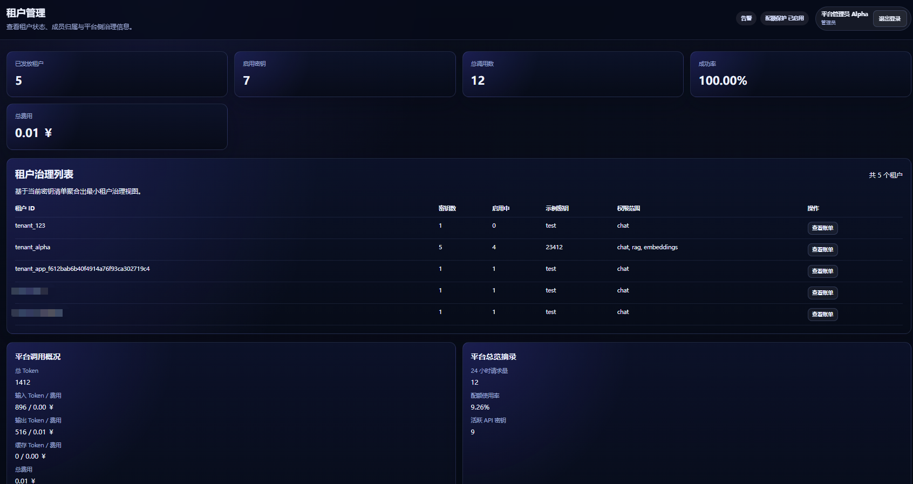
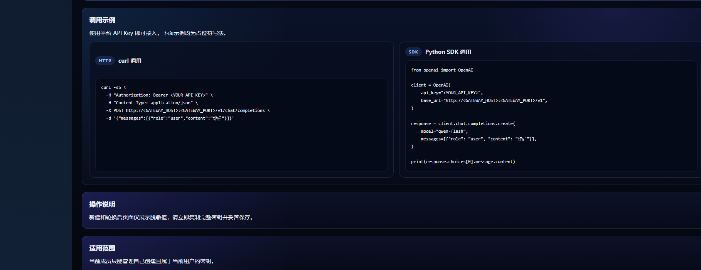
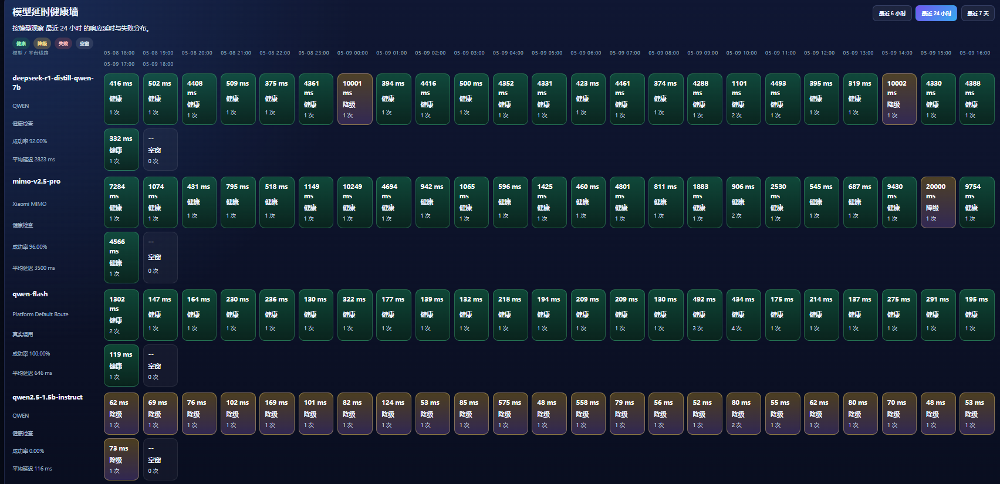

# AI Gateway

一个面向企业与团队的租户制 AI API 接入平台。它把账号申请、租户开通、平台 API Key 分发、调用治理、审计追踪和统一接口接入放在同一套系统里，对外只暴露平台能力，不暴露真实上游凭据。

本项目采用 [MIT License](LICENSE) 开源协议。

## 产品定位

平台当前主线是：

`账号申请 -> admin 审批 -> 开通租户 -> member 自助创建平台 API Key -> 调用统一接口 -> 按租户统计 token / 请求 / 失败 -> 输出审计记录`

## 当前能力

- **统一接入**：OpenAI 兼容接口，隐藏上游厂商 API Key，只暴露平台 API Key
- **租户治理**：账号申请与审批、模型范围 / Token / 金额上限、注销申请与 Key 清理
- **Key 生命周期**：member 自助创建、轮换、停用、删除，脱敏展示与按租户追踪
- **模型与路由**：Qwen / MIMO 双上游、显式模型调用、provider 后台配置、`encrypted` / `secret_ref` 凭据模式、任务特征智能路由
- **观测与审计**：运行视图、趋势统计、延时健康墙、异常事件流、调用明细、脱敏摘要、审计轨迹
- **费用与配额**：按租户统计 Token / 请求 / 缓存，模型计价、费用估算、月度配额与账单
- **控制台**：admin（总览、审批、租户、密钥、观测、审计、模型管理）与 member（总览、密钥、用量、审计）

## 系统价值

- 企业内部统一 AI 出口与部门级调用治理平台
- 多模型、多厂商的统一接入层与 API Key 分发审计中心
- 后续限流、熔断、成本控制、模型运营的平台底座

## 后续规划

| 方向 | 重点 |
|------|------|
| 治理与安全 | 用户级标识与限流、细粒度模型权限、内容审核与风控告警 |
| 稳定性 | 熔断降级、错误率摘除、TTFT 超时切换、备用模型自动切换 |
| 路由与性能 | 多 Key 轮询、负载均衡、语义缓存、可配置任务分类路由 |
| 管理与运营 | 账单中心、部门 / 租户 / 用户费用拆分、健康趋势留存、运营报表 |
| 平台演进 | 用户级调用观测、更多 provider、MCP / RAG / Agent 能力评估 |

详细技术说明见 [当前功能与技术概览.md](当前功能与技术概览.md)。

## 界面预览

以下截图位于仓库 `docs/image/` 目录：

### 1. 总览与租户治理

<p align="center">
  
  
</p>

### 2. API Key 与调用接入

<p align="center">
  
  
</p>

### 3. 调用观测与模型健康

<p align="center">
  
  
</p>

## 公网访问

- 控制台前端：`http://8.162.21.158:31873`
- 已配置安全组来源 IP 白名单，访问前需申请放行

## 服务组成

| 组件 | 技术栈 | 职责 |
|------|--------|------|
| `gateway/` | Go | 鉴权、路由、计费、审计、管理 API |
| `web/` | React | admin / member 控制台 |
| `rag-service/` | Python | 内部检索（容器内网） |
| `model-service/` | Python | 模型服务占位层 |
| 基础设施 | Compose | PostgreSQL、Redis、RabbitMQ |

## 目录结构

```text
ai_gateway/
├── deploy/         # Compose 与部署配置
├── docs/           # 设计文档
├── gateway/        # Go 网关
├── model-service/  # 模型服务占位层
├── rag-service/    # 内部检索支撑服务
├── scripts/        # 测试、lint、验证脚本
└── web/            # React 控制台
```

## 快速开始

部署配置与验证命令详见 [配置清单.md](配置清单.md)。

### 1. 准备配置

```bash
cd ai_gateway
cp deploy/compose/.env.example deploy/compose/.env.local
```

### 2. 准备 secrets

```bash
mkdir -p "${HOME}/.ai_gateway_secrets"
```

### 3. 启动

```bash
docker compose --env-file deploy/compose/.env.local -f deploy/compose/compose.yml up -d --build
```

### 4. 验证

```bash
curl http://127.0.0.1:32658/healthz
```

- 控制台：`http://127.0.0.1:31873`
- 网关 API：`http://127.0.0.1:32658`

## 质量命令

```bash
./scripts/test.sh
./scripts/lint.sh
docker compose --env-file deploy/compose/.env.example -f deploy/compose/compose.yml config
```

## 安全说明

- 仓库中不提交真实 API Key、控制台密码、数据库 / Redis 密码
- `deploy/compose/.env.example` 仅提供占位符
- 平台只向租户暴露平台 API Key，上游密钥通过文件挂载或环境变量注入

## License

本项目以 [MIT License](LICENSE) 发布。
